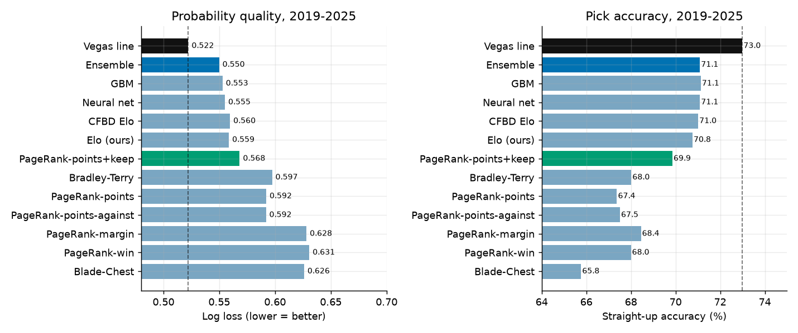
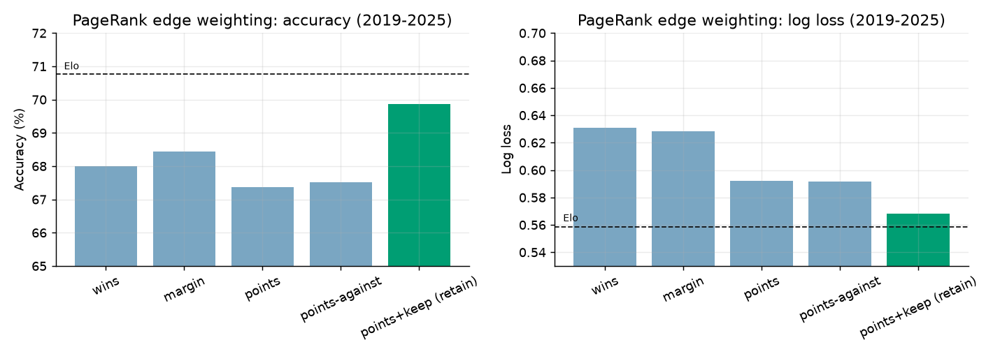
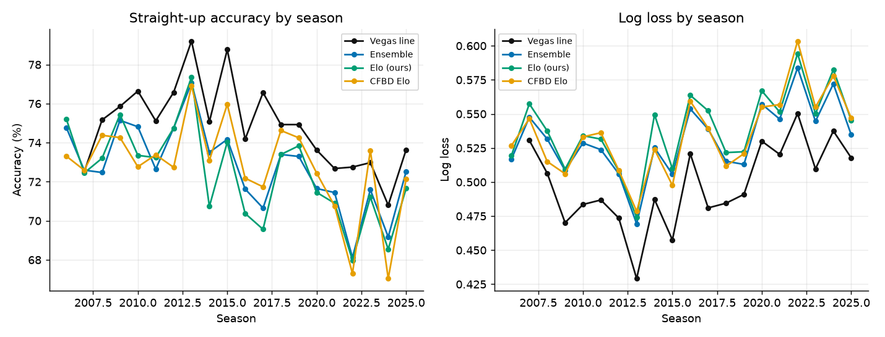
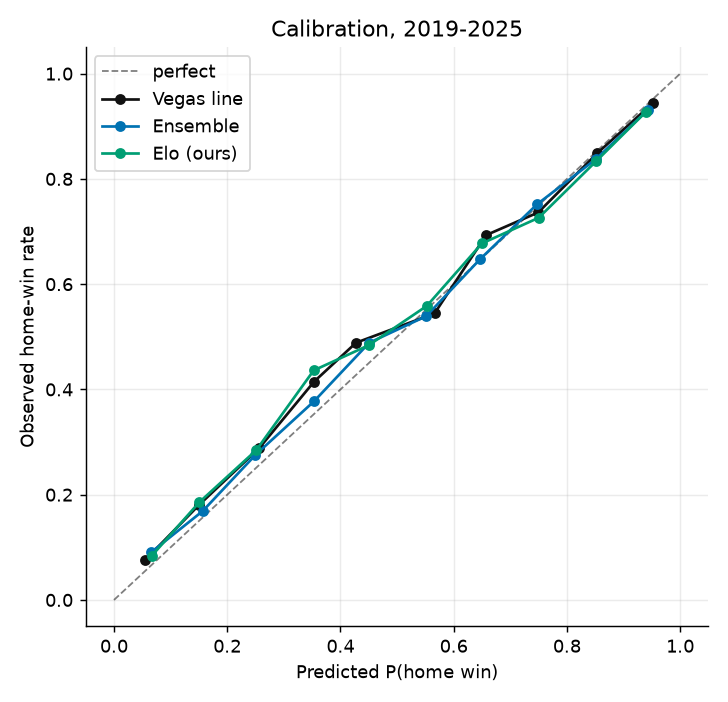
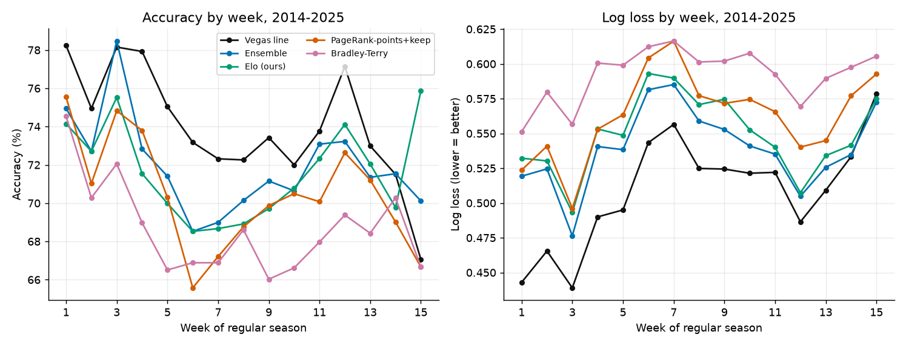

# Ranking College Football Teams and Predicting Games (2001–2025)

**Goal.** Build several *classes* of team-rating systems — PageRank/network methods,
Elo/paired-comparison methods, and machine-learning models — then judge each one the
only way that matters: **train on everything up to a given week, predict the next week's
games, and score the predictions out-of-sample.** Benchmarks are the two things that are
genuinely hard to beat — the **Vegas closing line** and **CollegeFootballData's own Elo**.

**Headline results (2019–2025, FBS-vs-FBS games):**

| Method | Class | Accuracy | Log loss | Brier |
|---|---|---:|---:|---:|
| **Vegas closing line** | *market benchmark* | **73.0%** | **0.522** | **0.176** |
| Ensemble (stack of our models) | ensemble | 71.1% | **0.549** | 0.186 |
| Gradient boosting (GBM) | ML | 71.1% | 0.553 | 0.187 |
| Neural net (MLP) | ML | 71.1% | 0.555 | 0.188 |
| CFBD Elo | *algo benchmark* | 71.0% | 0.560 | 0.189 |
| Elo (tuned, ours) | Elo | 70.8% | 0.559 | 0.190 |
| **PageRank (points + keep)** | **network** | **69.9%** | **0.568** | **0.194** |
| Bradley–Terry | paired-comparison | 68.0% | 0.597 | 0.206 |
| PageRank (points-against) | network | 67.5% | 0.592 | 0.204 |
| PageRank (points) | network | 67.4% | 0.592 | 0.204 |
| PageRank (margin) | network | 68.5% | 0.628 | 0.212 |
| PageRank (wins) | network | 68.0% | 0.631 | 0.213 |
| Blade–Chest | intransitive | 65.8% | 0.626 | 0.218 |

*(All batch rankers now carry information from several prior seasons via a tuned
recency decay — §2.2.)*



Three findings drive everything below:

1. **Elo-class online models beat most network (PageRank) models for prediction** — *but
   the gap is almost entirely about how rank is transferred, not about PageRank itself.*
   A points-flow PageRank where each team **retains** rank in proportion to the points it
   scores (`points+keep`, §2.1) jumps from the ~67% pack to **69.9% / 0.572**, essentially
   matching tuned Elo. The naïve win/margin PageRanks are fine *descriptive* rankers but
   poorly-calibrated *predictors*.
2. **Machine learning adds a little, ensembling adds a little more, but the gains are
   small.** The whole field of "our" models sits in a tight band around 71% / 0.55.
3. **The market is the ceiling, and it is efficient.** No model beats the closing spread
   against the number (all ≈ 49.5% vs a 52.4% break-even), and adding our best model to the
   market improves log loss by 0.0003. When our ensemble and the market *disagree* on the
   winner, **the market is right 58% of the time.**

---

## 1. Data

Source: [`cfbfastR-data`](https://github.com/sportsdataverse/cfbfastR-data), a public
mirror of [CollegeFootballData.com](https://collegefootballdata.com).

* **Games**, 2001–2025: 36,868 completed games (all divisions retained so that
  guarantee games still inform ratings); **17,472 FBS-vs-FBS** games form the evaluation
  set.
* **Betting lines**, 2006–2025: 1.18M book-level rows. We reduce these to one **consensus
  closing spread per game** (median across books, placed on the home team's perspective).
  The spread file carries only a per-row team *abbreviation*, so the home/away assignment
  is recovered by a majority-vote abbreviation→team map — validated by the sanity check
  that spread favorites go **74.7%** straight-up, exactly the known CFB rate.
* **CFBD pregame Elo** ships with each game and is used only as an external benchmark.

> **On AP / CFP polls:** weekly poll data is not present in this dataset and the live CFBD
> API is blocked by this environment's network policy, so the poll comparison the brief
> mentions was replaced by the stronger alternative it also offers — **betting lines**.
> Polls only rank ~25 teams and are published *after* games, making them a weak and biased
> predictor; the closing line is a superior, complete, and genuinely adversarial benchmark.

## 2. Methods

Every model is evaluated **walk-forward** with no leakage. Online models (Elo) make one
chronological pass, predicting each game from ratings as they stood at kickoff. Batch
models (PageRank, Bradley–Terry, Blade–Chest) are **refit every week** on all prior games;
ML models are refit **once per season** on all prior seasons, with weekly-updating features.

### PageRank family (`src/cfbrank/rankers.py`)
A directed graph where **rank flows from loser to winner**; the stationary distribution is
the rating. Three edge-weighting schemes answer *"how much weight should transfer per
edge?"*:
* **wins** — one unit per result;
* **margin** — edge weight grows with (capped) margin of victory;
* **points** — bidirectional flow, each team sends the opponent's points (dominance-aware).

Ratings are mapped to win probabilities by a logistic calibrator fit on the training games.
We **tuned** the margin cap and damping on 2013–2018 (see `results/tuning_pagerank.csv`):
heavier margin weighting helps slightly (best cap ≈ 45, damping 0.85), but even the best
win/margin PageRank is dominated by Elo. *How* rank flows matters far more than the raw
graph — which motivates the point-flow variants below.

#### 2.1 Point-flow PageRank (and a self-retention twist)

Two schemes distribute rank by *points* rather than by wins:

* **`points-against`** — each team sends its rank to opponents **in proportion to the points
  those opponents scored on it**. If a team's three opponents scored 3, 10, and 7 on it,
  they receive 15% / 50% / 35% of its outflow. A close game just swaps rank symmetrically; a
  blowout ships rank to the team that scored. (This is the clean, `+1`-free version of the
  earlier `points` variant, and performs identically to it: **67.0%**.)
* **`points+keep`** — *same opponent flow, but a team also **retains** rank through a
  self-loop weighted by the points it scored.* If that team also scored 20 points total
  (= the 20 it allowed), it **keeps 50%** and splits the other 50% as 15/50/35. The
  season-long keep/give split per team is `points scored / (points scored + points allowed)`.

The self-retention twist is the single biggest lever in the whole PageRank family:



`points+keep` gains **+2.5 accuracy points and ~0.03 log loss** over every other PageRank
variant and **lands right on tuned Elo** (69.9% vs 70.8% accuracy; 0.568 vs 0.559 log loss,
2019–2025) — and the effect is stable in every era back to 2006 (`results/metrics_overall.csv`).
Intuitively, a self-loop proportional to points scored stops strong offenses from bleeding
all their rank to whoever they just beat, and folds *offensive output* directly into the
stationary distribution — the piece of information plain loser→winner PageRank throws away.

#### 2.2 Cross-season memory (recency-decay)

A ranker that only looks at the current season is blind in week 1 — it has no reason to think
Ohio State will be good before Ohio State has played. So every batch model instead fits on the
**last seven seasons**, weighting a game from `d` seasons ago by `decay ** d` (current season =
1). This is a program's carried-over reputation: heavy in September, fading as fresh results
arrive. Elo already does the equivalent through its **between-season regression** (keep 85% of
last year's rating, tuned `regress=0.15`), which is why Elo predicts week 1 respectably.

The decay is tuned per family (`results/tuning_decay.csv`), and it matters which way you lean:

| `decay` | current-season only (0) | recency (0.35) | balanced (0.5) | long memory (0.65) | equal (1.0) |
|---|---|---|---|---|---|
| **PageRank points+keep** (log loss) | 0.609 | **0.551** | 0.561 | 0.576 | 0.619 |
| **Bradley–Terry** (log loss) | 0.636 | 0.594 | 0.587 | **0.584** | 0.592 |

Two lessons: (1) **using prior seasons is a large win** — dropping them (decay 0) costs
Bradley–Terry ~5 accuracy points and ~0.05 log loss; (2) the *right amount* of memory is
model-specific. Point-flow **PageRank favours recency (0.35)** — its graph is information-dense,
so last year fades fast — whereas **Bradley–Terry wants more history (0.65)**, because MLE team
strengths need many games to pin down and stale data still helps stabilise them. We use each
family's optimum (PageRank 0.35, Bradley–Terry 0.65, Blade–Chest 0.5). The payoff is
concentrated in the early weeks, exactly where it should be (§3, by-week).

### Elo / paired-comparison (`src/cfbrank/elo.py`, `rankers.py`)
* **Elo** with a 538-style margin-of-victory multiplier, home-field advantage, and
  between-season regression to the mean. Tuned on 2007–2015 → **K=40, HFA=50 Elo pts,
  regress=0.15** (`results/tuning_elo.csv`).
* **Bradley–Terry** — logistic maximum-likelihood team strengths + a global home edge,
  L2-shrunk, refit weekly on several recency-weighted seasons (§2.2).
* **Blade–Chest** (Chen & Joachims 2016) — each team gets a low-rank *blade* (offense) and
  *chest* (defense) vector so the model can represent **intransitive** ("rock–paper–
  scissors") matchups a single number cannot.

### Machine learning (`src/cfbrank/mlmodels.py`)
Gradient boosting and a small neural net over ten pre-game features (our Elo rating/prob,
season win %, scoring margin, rest, games played, home/neutral, conference game).

### Ensemble (`scripts/run_backtest.py`)
A per-season logistic **stack** over the base models' log-odds (Elo, BT, PageRank points+keep,
Blade–Chest, GBM, MLP). A second stack combines **market + our ensemble** to test whether
our models carry any information the market has not already priced.

## 3. Results

### The market is the ceiling — and it is efficient


Across every era the ordering is stable: **market > {ML ≈ ensemble ≈ Elo} > paired-
comparison > network**. The gap from our best model to the market is ~2 points of accuracy
and ~0.03 of log loss and has **not closed** in recent years.

The efficiency tests are unambiguous:

| Test (2019–2025) | Result |
|---|---|
| Best model vs closing spread, against the number | **49.6%** (break-even 52.4%) |
| Market + our ensemble, log loss | 0.5220 vs market-alone 0.5223 |
| Ensemble vs market disagree on the winner | 12.1% of games |
| …of those, **market** picks correctly | **58.1%** |
| …of those, **our ensemble** picks correctly | 41.9% |

Our models are *near* the prediction frontier but the closing line dominates the small set
of games where they differ. There is no free money here — which is the expected, honest
result for a liquid market.

### Calibration


The market and the ensemble are both well-calibrated; the ensemble's per-season stacking
noticeably improves calibration over any single base model (log loss 0.549 vs Elo's 0.559
and GBM's 0.553), even though it barely moves raw accuracy — the value of ensembling here
is *sharper probabilities*, not more correct sides.

### Timing: when is each model good, and when does the market pull ahead?


Both panels share a shape: games are **easiest at the very start** (mismatched openers →
~78% / 0.44 log loss for the market), get **hardest in the mid-season conference grind**
(weeks 6–7, ~72% / 0.55), ease again around rivalry week, then tighten for conference title
games in week 15. Every model rises and falls together — difficulty is a property of the
*slate*, not the method. The batch models keep their usual ordering at every week
(Elo ≳ PageRank points+keep > Bradley–Terry), so no model has a special "time of year".

The one real timing effect is in **the market's edge**, and it points the opposite way to
intuition — the market is *most* dominant early and our models close the gap as the season
plays out:

| | Week 1 | Week 4 | Week 7 | Week 12 |
|---|---:|---:|---:|---:|
| market − ensemble, log loss gap | **0.076** | 0.051 | 0.029 | 0.018 |

In September the closing line embeds a full offseason of information our results-only models
cannot see — recruiting, the transfer portal, returning production, coaching changes,
preseason expectations. By November, enough games have been played that Elo/points+keep have
largely recovered that context from results alone, and the gap to Vegas roughly halves and
halves again. The cross-season decay (§2.2) is what keeps our models competitive in weeks 1–3
at all; without it the network and paired-comparison models would open the season near a
coin flip.

### Final 2025 ratings (illustrative)
Top of the end-of-2025 boards (FBS only; full table in `results/rankings_2025.csv`):

| # | Elo (ours) | Bradley–Terry |
|--:|---|---|
| 1 | Indiana | Ohio State |
| 2 | Ohio State | Georgia |
| 3 | Oregon | Oregon |
| 4 | Georgia | Notre Dame |
| 5 | Miami | Alabama |

The two boards make the trade-offs concrete. **Elo** is margin-aware and leans on the current
season, so it crowns **Indiana** for *this* year's unbeaten, dominant run. **Bradley–Terry**
ignores margin and carries a longer memory (decay 0.65, §2.2), so it leans toward sustained
program strength and puts the blue-bloods (Ohio State, Georgia, Notre Dame, Alabama) on top.
Neither is "right" — they answer different questions, and *what you feed the ranker* (margin?
how many seasons?) moves the board as much as *which algorithm* you pick.

## 4. Takeaways

* **For prediction, use Elo (or an ML model on Elo-style features).** It is simple, online,
  well-calibrated, and within a whisker of far more complex models.
* **PageRank *can* forecast — if rank flows the right way.** Win/margin-weighted PageRank is
  badly calibrated, but a points-flow walk with **self-retention proportional to points
  scored** (`points+keep`) matches Elo. The edge-weighting scheme, not the algorithm, is
  what separates a 67% predictor from a 70% one.
* **Prior seasons matter, and the right dose is model-specific.** Carrying several
  recency-weighted seasons is worth ~5 accuracy points to Bradley–Terry and rescues every
  batch model's first three weeks; point-flow PageRank wants a short memory (decay 0.35),
  Bradley–Terry a longer one (0.65).
* **The market's edge is a September phenomenon.** Vegas is ~0.076 log loss better than our
  ensemble in week 1 but only ~0.018 by week 12 — its advantage is offseason information, and
  results-based models recover most of it once games are played.
* **Blade–Chest's intransitivity did not pay off** at CFB sample sizes — the extra
  parameters cost more (variance) than the matchup structure returns.
* **Ensembling buys calibration, not accuracy**, and **nothing we built beats the closing
  line.** The interesting open direction is not a better single ranker but richer *inputs*
  (drive/play-by-play efficiency, returning production, injuries, weather) — signal the
  market uses that box-score-only ratings never see.

## 5. Reproduce

```bash
pip install -r requirements.txt
python -m src.cfbrank.data          # build data/games.csv.gz (needs the cfbfastR-data checkout)
python scripts/run_backtest.py      # walk-forward backtest -> results/*.csv, ~4 min
python scripts/make_figures.py      # figures + results/rankings_2025.csv
python scripts/ats_analysis.py      # market-efficiency tests
```

All metrics come from `results/predictions.csv.gz` (one out-of-sample probability per model
per game). Data provenance and caveats are documented in `src/cfbrank/data.py`.
