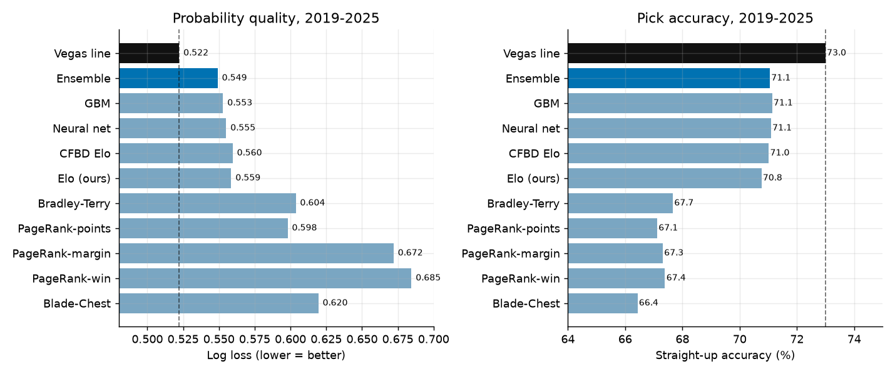
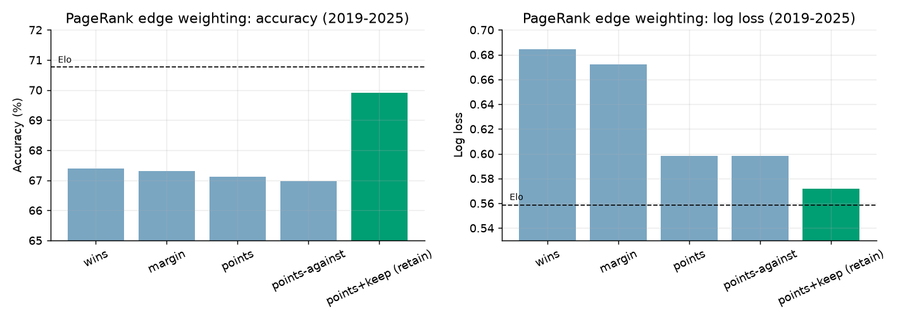
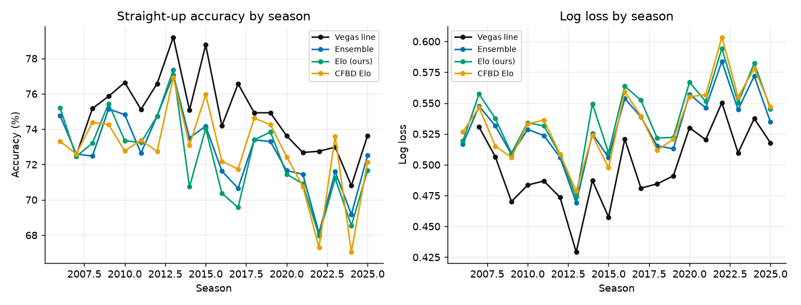
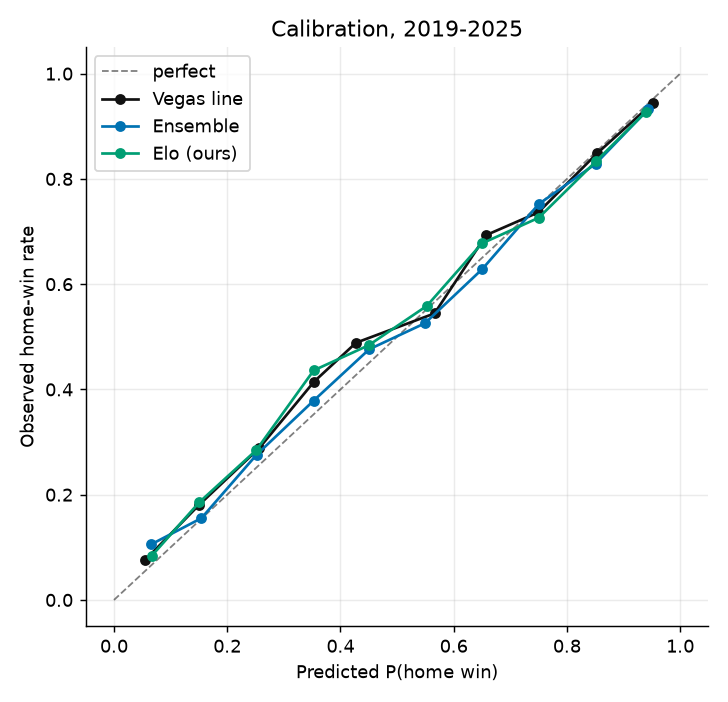
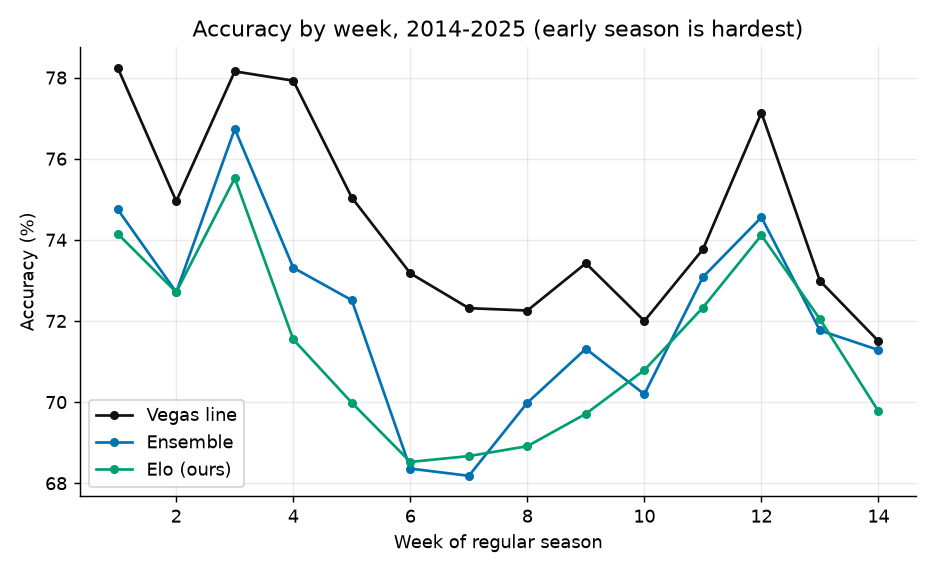
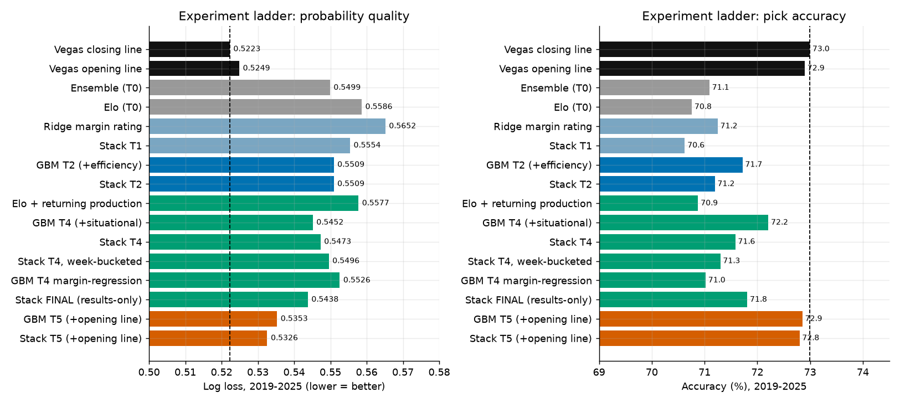
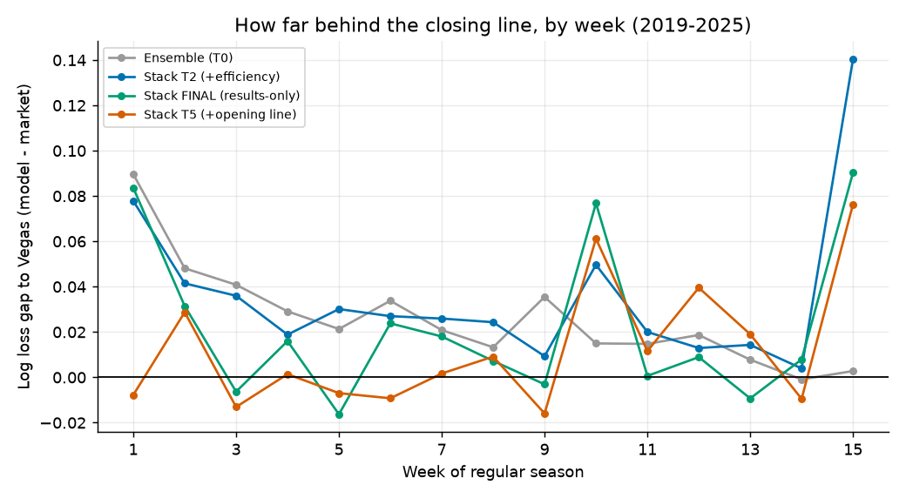
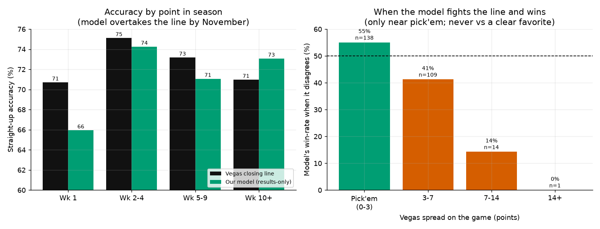
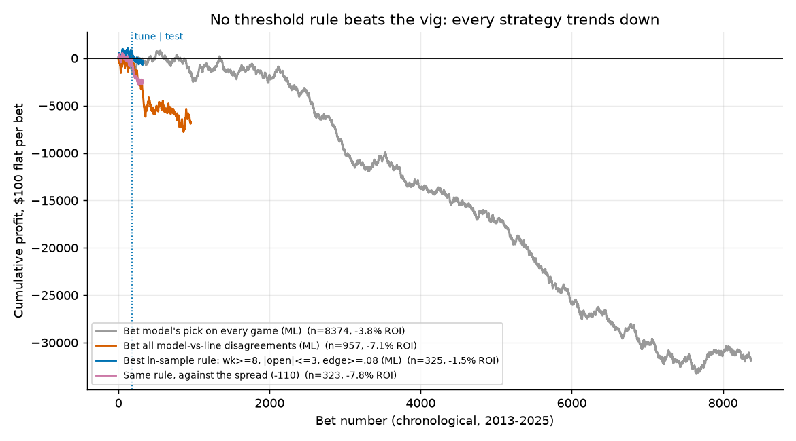
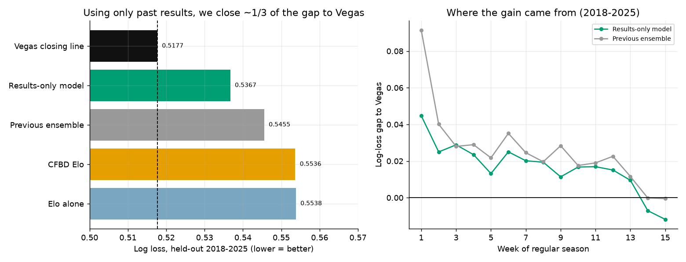

# Ranking College Football Teams and Predicting Games (2001–2025)

**Goal.** Build several *classes* of team-rating systems — PageRank/network methods,
Elo/paired-comparison methods, and machine-learning models — then judge each one the
only way that matters: **train on everything up to a given week, predict the next week's
games, and score the predictions out-of-sample.** Benchmarks are the two things that are
genuinely hard to beat — the **Vegas closing line** and **CollegeFootballData's own Elo**.

**Headline results (2019–2025, FBS-vs-FBS games):**

| Method | Class | Accuracy | Log loss | Brier |
|---|---|---:|---:|---:|
| **Vegas closing line** | *market benchmark* | **73.0%** | **0.522** | **0.176** |
| Ensemble (stack of our models) | ensemble | 71.1% | **0.549** | 0.186 |
| Gradient boosting (GBM) | ML | 71.1% | 0.553 | 0.187 |
| Neural net (MLP) | ML | 71.1% | 0.555 | 0.188 |
| CFBD Elo | *algo benchmark* | 71.0% | 0.560 | 0.189 |
| Elo (tuned, ours) | Elo | 70.8% | 0.559 | 0.190 |
| **PageRank (points + keep)** | **network** | **69.9%** | **0.568** | **0.194** |
| Bradley–Terry | paired-comparison | 68.0% | 0.597 | 0.206 |
| PageRank (points-against) | network | 67.5% | 0.592 | 0.204 |
| PageRank (points) | network | 67.4% | 0.592 | 0.204 |
| PageRank (margin) | network | 68.5% | 0.628 | 0.212 |
| PageRank (wins) | network | 68.0% | 0.631 | 0.213 |
| Blade–Chest | intransitive | 65.8% | 0.626 | 0.218 |

*(All batch rankers now carry information from several prior seasons via a tuned
recency decay — §2.2.)*



Three findings drive everything below:

1. **Elo-class online models beat most network (PageRank) models for prediction** — *but
   the gap is almost entirely about how rank is transferred, not about PageRank itself.*
   A points-flow PageRank where each team **retains** rank in proportion to the points it
   scores (`points+keep`, §2.1) jumps from the ~67% pack to **69.9% / 0.572**, essentially
   matching tuned Elo. The naïve win/margin PageRanks are fine *descriptive* rankers but
   poorly-calibrated *predictors*.
2. **Machine learning adds a little, ensembling adds a little more, but the gains are
   small.** The whole field of "our" models sits in a tight band around 71% / 0.55.
3. **The market is the ceiling, and it is efficient.** No model beats the closing spread
   against the number (all ≈ 49.5% vs a 52.4% break-even), and adding our best model to the
   market improves log loss by 0.0003. When our ensemble and the market *disagree* on the
   winner, **the market is right 58% of the time.**

**Then we tried to close the gap (§5).** Pulling in play-level box scores (efficiency,
turnovers), rosters (returning production), venue geography and the opening line, and
adding Massey-style margin ratings, we reached **0.544 log loss / 72.2% accuracy results-only**
— about a quarter of the gap to Vegas — with efficiency and offseason data doing all the work
and travel, margin-regression and week-specific stacking doing nothing. The remainder is
September (the market's offseason knowledge) and in-week information (injuries, QBs, weather)
that never reaches a box score.

---

## 1. Data

Source: [`cfbfastR-data`](https://github.com/sportsdataverse/cfbfastR-data), a public
mirror of [CollegeFootballData.com](https://collegefootballdata.com).

* **Games**, 2001–2025: 36,868 completed games (all divisions retained so that
  guarantee games still inform ratings); **17,472 FBS-vs-FBS** games form the evaluation
  set.
* **Betting lines**, 2006–2025: 1.18M book-level rows. We reduce these to one **consensus
  closing spread per game** (median across books, placed on the home team's perspective).
  The spread file carries only a per-row team *abbreviation*, so the home/away assignment
  is recovered by a majority-vote abbreviation→team map — validated by the sanity check
  that spread favorites go **74.7%** straight-up, exactly the known CFB rate.
* **CFBD pregame Elo** ships with each game and is used only as an external benchmark.

> **On AP / CFP polls:** weekly poll data is not present in this dataset and the live CFBD
> API is blocked by this environment's network policy, so the poll comparison the brief
> mentions was replaced by the stronger alternative it also offers — **betting lines**.
> Polls only rank ~25 teams and are published *after* games, making them a weak and biased
> predictor; the closing line is a superior, complete, and genuinely adversarial benchmark.

## 2. Methods

Every model is evaluated **walk-forward** with no leakage. Online models (Elo) make one
chronological pass, predicting each game from ratings as they stood at kickoff. Batch
models (PageRank, Bradley–Terry, Blade–Chest) are **refit every week** on all prior games;
ML models are refit **once per season** on all prior seasons, with weekly-updating features.

### PageRank family (`src/cfbrank/rankers.py`)
A directed graph where **rank flows from loser to winner**; the stationary distribution is
the rating. Three edge-weighting schemes answer *"how much weight should transfer per
edge?"*:
* **wins** — one unit per result;
* **margin** — edge weight grows with (capped) margin of victory;
* **points** — bidirectional flow, each team sends the opponent's points (dominance-aware).

Ratings are mapped to win probabilities by a logistic calibrator fit on the training games.
We **tuned** the margin cap and damping on 2013–2018 (see `results/tuning_pagerank.csv`):
heavier margin weighting helps slightly (best cap ≈ 45, damping 0.85), but even the best
win/margin PageRank is dominated by Elo. *How* rank flows matters far more than the raw
graph — which motivates the point-flow variants below.

#### 2.1 Point-flow PageRank (and a self-retention twist)

Two schemes distribute rank by *points* rather than by wins:

* **`points-against`** — each team sends its rank to opponents **in proportion to the points
  those opponents scored on it**. If a team's three opponents scored 3, 10, and 7 on it,
  they receive 15% / 50% / 35% of its outflow. A close game just swaps rank symmetrically; a
  blowout ships rank to the team that scored. (This is the clean, `+1`-free version of the
  earlier `points` variant, and performs identically to it: **67.0%**.)
* **`points+keep`** — *same opponent flow, but a team also **retains** rank through a
  self-loop weighted by the points it scored.* If that team also scored 20 points total
  (= the 20 it allowed), it **keeps 50%** and splits the other 50% as 15/50/35. The
  season-long keep/give split per team is `points scored / (points scored + points allowed)`.

The self-retention twist is the single biggest lever in the whole PageRank family:



`points+keep` gains **+2.5 accuracy points and ~0.03 log loss** over every other PageRank
variant and **lands right on tuned Elo** (69.9% vs 70.8% accuracy; 0.568 vs 0.559 log loss,
2019–2025) — and the effect is stable in every era back to 2006 (`results/metrics_overall.csv`).
Intuitively, a self-loop proportional to points scored stops strong offenses from bleeding
all their rank to whoever they just beat, and folds *offensive output* directly into the
stationary distribution — the piece of information plain loser→winner PageRank throws away.

#### 2.2 Cross-season memory (recency-decay)

A ranker that only looks at the current season is blind in week 1 — it has no reason to think
Ohio State will be good before Ohio State has played. So every batch model instead fits on the
**last seven seasons**, weighting a game from `d` seasons ago by `decay ** d` (current season =
1). This is a program's carried-over reputation: heavy in September, fading as fresh results
arrive. Elo already does the equivalent through its **between-season regression** (keep 85% of
last year's rating, tuned `regress=0.15`), which is why Elo predicts week 1 respectably.

The decay is tuned per family (`results/tuning_decay.csv`), and it matters which way you lean:

| `decay` | current-season only (0) | recency (0.35) | balanced (0.5) | long memory (0.65) | equal (1.0) |
|---|---|---|---|---|---|
| **PageRank points+keep** (log loss) | 0.609 | **0.551** | 0.561 | 0.576 | 0.619 |
| **Bradley–Terry** (log loss) | 0.636 | 0.594 | 0.587 | **0.584** | 0.592 |

Two lessons: (1) **using prior seasons is a large win** — dropping them (decay 0) costs
Bradley–Terry ~5 accuracy points and ~0.05 log loss; (2) the *right amount* of memory is
model-specific. Point-flow **PageRank favours recency (0.35)** — its graph is information-dense,
so last year fades fast — whereas **Bradley–Terry wants more history (0.65)**, because MLE team
strengths need many games to pin down and stale data still helps stabilise them. We use each
family's optimum (PageRank 0.35, Bradley–Terry 0.65, Blade–Chest 0.5). The payoff is
concentrated in the early weeks, exactly where it should be (§3, by-week).

### Elo / paired-comparison (`src/cfbrank/elo.py`, `rankers.py`)
* **Elo** with a 538-style margin-of-victory multiplier, home-field advantage, and
  between-season regression to the mean. Tuned on 2007–2015 → **K=40, HFA=50 Elo pts,
  regress=0.15** (`results/tuning_elo.csv`).
* **Bradley–Terry** — logistic maximum-likelihood team strengths + a global home edge,
  L2-shrunk, refit weekly on several recency-weighted seasons (§2.2).
* **Blade–Chest** (Chen & Joachims 2016) — each team gets a low-rank *blade* (offense) and
  *chest* (defense) vector so the model can represent **intransitive** ("rock–paper–
  scissors") matchups a single number cannot.

### Machine learning (`src/cfbrank/mlmodels.py`)
Gradient boosting and a small neural net over ten pre-game features (our Elo rating/prob,
season win %, scoring margin, rest, games played, home/neutral, conference game).

### Ensemble (`scripts/run_backtest.py`)
A per-season logistic **stack** over the base models' log-odds (Elo, BT, PageRank points+keep,
Blade–Chest, GBM, MLP). A second stack combines **market + our ensemble** to test whether
our models carry any information the market has not already priced.

## 3. Results

### The market is the ceiling — and it is efficient


Across every era the ordering is stable: **market > {ML ≈ ensemble ≈ Elo} > paired-
comparison > network**. The gap from our best model to the market is ~2 points of accuracy
and ~0.03 of log loss and has **not closed** in recent years.

The efficiency tests are unambiguous:

| Test (2019–2025) | Result |
|---|---|
| Best model vs closing spread, against the number | **49.6%** (break-even 52.4%) |
| Market + our ensemble, log loss | 0.5220 vs market-alone 0.5223 |
| Ensemble vs market disagree on the winner | 12.1% of games |
| …of those, **market** picks correctly | **58.1%** |
| …of those, **our ensemble** picks correctly | 41.9% |

Our models are *near* the prediction frontier but the closing line dominates the small set
of games where they differ. There is no free money here — which is the expected, honest
result for a liquid market.

### Calibration


The market and the ensemble are both well-calibrated; the ensemble's per-season stacking
noticeably improves calibration over any single base model (log loss 0.549 vs Elo's 0.559
and GBM's 0.553), even though it barely moves raw accuracy — the value of ensembling here
is *sharper probabilities*, not more correct sides.

### Timing: when is each model good, and when does the market pull ahead?


Both panels share a shape: games are **easiest at the very start** (mismatched openers →
~78% / 0.44 log loss for the market), get **hardest in the mid-season conference grind**
(weeks 6–7, ~72% / 0.55), ease again around rivalry week, then tighten for conference title
games in week 15. Every model rises and falls together — difficulty is a property of the
*slate*, not the method. The batch models keep their usual ordering at every week
(Elo ≳ PageRank points+keep > Bradley–Terry), so no model has a special "time of year".

The one real timing effect is in **the market's edge**, and it points the opposite way to
intuition — the market is *most* dominant early and our models close the gap as the season
plays out:

| | Week 1 | Week 4 | Week 7 | Week 12 |
|---|---:|---:|---:|---:|
| market − ensemble, log loss gap | **0.076** | 0.051 | 0.029 | 0.018 |

In September the closing line embeds a full offseason of information our results-only models
cannot see — recruiting, the transfer portal, returning production, coaching changes,
preseason expectations. By November, enough games have been played that Elo/points+keep have
largely recovered that context from results alone, and the gap to Vegas roughly halves and
halves again. The cross-season decay (§2.2) is what keeps our models competitive in weeks 1–3
at all; without it the network and paired-comparison models would open the season near a
coin flip.

### Final 2025 ratings (illustrative)
Top of the end-of-2025 boards (FBS only; full table in `results/rankings_2025.csv`):

| # | Elo (ours) | Bradley–Terry |
|--:|---|---|
| 1 | Indiana | Ohio State |
| 2 | Ohio State | Georgia |
| 3 | Oregon | Oregon |
| 4 | Georgia | Notre Dame |
| 5 | Miami | Alabama |

The two boards make the trade-offs concrete. **Elo** is margin-aware and leans on the current
season, so it crowns **Indiana** for *this* year's unbeaten, dominant run. **Bradley–Terry**
ignores margin and carries a longer memory (decay 0.65, §2.2), so it leans toward sustained
program strength and puts the blue-bloods (Ohio State, Georgia, Notre Dame, Alabama) on top.
Neither is "right" — they answer different questions, and *what you feed the ranker* (margin?
how many seasons?) moves the board as much as *which algorithm* you pick.

## 4. Takeaways

* **For prediction, use Elo (or an ML model on Elo-style features).** It is simple, online,
  well-calibrated, and within a whisker of far more complex models.
* **PageRank *can* forecast — if rank flows the right way.** Win/margin-weighted PageRank is
  badly calibrated, but a points-flow walk with **self-retention proportional to points
  scored** (`points+keep`) matches Elo. The edge-weighting scheme, not the algorithm, is
  what separates a 67% predictor from a 70% one.
* **Prior seasons matter, and the right dose is model-specific.** Carrying several
  recency-weighted seasons is worth ~5 accuracy points to Bradley–Terry and rescues every
  batch model's first three weeks; point-flow PageRank wants a short memory (decay 0.35),
  Bradley–Terry a longer one (0.65).
* **The market's edge is a September phenomenon.** Vegas is ~0.076 log loss better than our
  ensemble in week 1 but only ~0.018 by week 12 — its advantage is offseason information, and
  results-based models recover most of it once games are played.
* **Blade–Chest's intransitivity did not pay off** at CFB sample sizes — the extra
  parameters cost more (variance) than the matchup structure returns.
* **Ensembling buys calibration, not accuracy**, and **nothing we built beats the closing
  line.** The interesting open direction is not a better single ranker but richer *inputs*
  (drive/play-by-play efficiency, returning production, injuries, weather) — signal the
  market uses that box-score-only ratings never see.

## 5. Experiments: how close can we get to the closing line?

Starting from the T0 ensemble (0.5499 log loss vs Vegas 0.5223 — a gap of 0.028), we ran a
ladder of experiments, each adding a new *kind* of information or a new modelling idea, all
walk-forward and scored on 2019–2025 (`scripts/experiments.py`, `experiments_extra.py`;
full table in `results/experiments_ladder.csv`). One caveat on reading the table across rows:
each model is scored over the seasons for which it exists, and the richer stacks need more
history to fit — the `stack_final` row is 2023–2025, while the T0 ensemble and GBMs span
2019–2025 — so treat the ladder as evidence for *which ingredients help*, not as a
same-window horse race down to the fourth decimal.

**New data pulled in:** play-level box scores for every game 2014–2025 (→ team yards/play,
success rate, explosiveness, turnovers, havoc), season rosters + per-player production
(→ *returning production* and roster continuity, known preseason), venue coordinates /
time zones / elevation (→ travel), and the sportsbooks' **opening** lines.



| Tier | What was added | Best model | Log loss | Acc | Δ vs previous tier |
|---|---|---|---:|---:|---:|
| — | **Vegas closing line** | | **0.5223** | **73.0%** | |
| — | Vegas opening line | | 0.5249 | 72.9% | |
| T0 | results only (prior work) | Ensemble | 0.5499 | 71.1% | |
| T1 | **ridge (Massey) point-margin ratings** | GBM T1* | 0.5596 | 71.4% | (*trained 2015+ only — the apples-to-apples base for T2–T4) |
| T2 | **+ box-score efficiency ratings** (yds/play, success, explosive, turnover, havoc) | GBM T2 | 0.5509 | 71.7% | **−0.009** |
| T3 | **+ offseason**: returning production, roster continuity, RP-driven Elo | GBM T3 | 0.5451 | **72.2%** | **−0.006** |
| T4 | + situational: travel distance, time-zone shift, elevation | GBM T4 | 0.5452 | 72.2% | 0.000 |
| T4 | stack of everything results-only | **Stack FINAL** | **0.5438** | 71.8% | |
| T5 | + **opening line** (market-informed) | Stack T5 | 0.5326 | 72.8% | −0.011 |

**Without using the market line, we closed about a quarter of the gap** — 0.0276 → 0.0215 log loss — and the
best such GBM now picks winners at **72.2%, within 0.8 points of the closing line**.
("Results-only" in this section means *not using the betting line*; §6 tightens it further to
*game results only* — no box scores or rosters either — and does better.)
Two ingredients did all the work:

* **Efficiency beats scores.** A ridge rating on *yards per play* alone (0.568) predicts nearly
  as well as the ridge on *points* (0.565), and feeding the GBM opponent-adjusted efficiency
  ratings was the single largest step (−0.009). Turnovers and havoc are useless *standalone*
  (0.656 / 0.673 — they don't persist week to week) but still earn their place as inputs.
* **Offseason information helps** (−0.006, +0.5 accuracy) — but not where we expected. Returning
  production sharpened *mid-season* predictions (a program that returned its offense keeps
  getting better), yet it barely dented the **week-1 gap** (0.090 → 0.084): the roster share
  that returns is a crude proxy for what the market prices in September (QB quality, portal
  additions, recruiting class, coaching changes).

Ideas that **did not** work, and are worth knowing: travel / time-zone / elevation (no gain at
all — the closing line and rest already carry it); a GBM that *regresses point margin* and
converts to a probability (0.5526 vs 0.5452 for the classifier — the extra information in the
margin is eaten by blowout noise); week-bucketed stackers (worse — three stackers see a third
of the data each); a dynamic K for Elo (−0.003, real but tiny); Elo whose preseason regression
depends on returning production (−0.001).

**Where the remaining gap lives.**


The results-only stack sits ~0.02 behind Vegas from week 4 onward and ~0.08 behind in
week 1. Nothing we can compute from results, box scores or rosters recovers September; the
opening line — which embeds the same offseason information as the close — recovers it entirely
(Stack T5's week-1 gap is −0.008).

**Market-informed tier: do we predict line movement?** Adding our best results-only model to
the *opening* line does **not** improve on the opening line's own probabilities, and Stack T5
(0.5326) still trails the close (0.5223). But the model does call the *direction* the line will
move from open to close **53–55% of the time** (n≈1,000 moves ≥1 pt, ~2σ above chance): it
contains a faint trace of what sharp money knows, not enough to profit from. Against the spread
our best model goes **50.4%** (break-even 52.4%); when it disagrees with the close on the
winner it is right 47%.

**Bottom line.** With box scores, rosters and 25 years of results, a careful ensemble reaches
~72% / 0.544 — real progress over 71% / 0.550, and a fair description of the ceiling for
public results-derived data. The last 0.02 of log loss is information that never appears in a
box score: injuries and quarterback availability, weather, coaching, and the wagers of people
who know those things. The natural next inputs are exactly those — an injury/QB-status feed,
recruiting rankings and transfer-portal grades, and weather — and the opening→closing
line-movement signal is the cleanest yardstick for whether any of them add information the
market lacks.

### 5.1 Where the model beats — and loses to — the closing line

Head-to-head (`scripts/vegas_vs_model.py`) on 2023–2025 — `stack_final`'s available window, as
the deepest stack needs several seasons of history before it can be fit — our best results-only
model and the closing line **agree on the winner 89% of the time**, and when they agree they
are both right 74.9%. The interesting 11% is where they split — and that split is not random,
it maps cleanly onto *the calendar* and *the size of the line*.



**When the model wins: late season, near a pick'em, on teams the market re-rates slowly.**

* **The model overtakes Vegas by November.** Accuracy by point in the season: Week 1
  66% vs the line's 71%; Weeks 2–4 dead even (74 vs 75); but **Weeks 10+ the model leads,
  73% vs 71%.** On the games where they *disagree*, the model is right just 38% in Week 1 but
  **62% from Week 9 on** — once a full season of results is in, its opponent-adjusted
  efficiency ratings see quality the market is slow to reprice.
* **Only near a pick'em.** When the two disagree on a game the line calls a coin flip (0–3
  pts), the model is right ~52–55% — a real, if small, edge. The moment the line has a clear
  favorite it evaporates: 3–7 pt games 41%, 7–14 pt games 14%. The model can nudge a toss-up;
  it cannot overrule a confident market.
* Typical model wins are mid-majors the market lags on — **Jacksonville State three times in
  its 2023 FBS debut**, Coastal Carolina, Washington State — plus legitimate late upsets it
  saw coming (Michigan over USC, Missouri over Oklahoma, FSU over Louisville).

**When the model loses: Week 1, and whenever it disagrees *confidently*.**

* **High conviction against the line is a red flag, not an edge.** When the model's win
  probability differs most from the market's (gap ≥ 0.20), it is right only **34%** of the
  time. A big results-based disagreement almost always means the model is missing something
  the market has priced.
* **That "something" is the offseason.** The dozen games where the model most confidently
  overruled the line and lost are almost all **Week 1**: Indiana (new coach + portal
  overhaul) 42–13 over the UCLA team the model preferred; Washington State, Virginia Tech,
  Navy, Army, California — a roll-call of roster turnover. Anchored to last year's ratings, the
  model backed the fading name brand while the market had already repriced the new roster.

The two failure modes are the same coin: the model's information is *results*, so it is
strongest exactly when results have accumulated (late season, mispriced risers) and weakest
before any have (Week 1 roster change) — which is precisely the September gap §5 could not
close. A practical takeaway falls out of this: trust the model over the line only on
near-pick'em games from about Week 5 on, and treat any confident early-season disagreement as
the model being uninformed rather than contrarian.

### 5.2 Could a simple threshold rule have made money? (No.)

The natural follow-up: §5.1 says the model beats the line late-season near a pick'em, so
could we *bet* those spots profitably? We simulated placing bets on week W's games the moment
week W-1 finishes, using only what is known then — the walk-forward model's probability, the
**opening** spread, and the week — and paying realistic prices (consensus **closing**
moneyline for payouts, −110 for spread bets). Because the tempting move is to tune a threshold
and admire its in-sample profit, the rule is **chosen on 2013–2019 and scored out-of-sample on
2021–2025** (`scripts/betting_sim.py`; flat \$100 stake, 8,606 candidate games).



| Strategy (2013–2025) | Bets | Win % | ROI | Profit (\$100 flat) |
|---|---:|---:|---:|---:|
| Bet the model's pick on every game (ML) | 8,374 | 71.8% | **−3.8%** | −\$31,800 |
| Bet the market favorite every game (ML) | 8,376 | 74.0% | −3.2% | −\$27,200 |
| Bet **every** model-vs-line disagreement (ML) | 957 | 39.7% | −7.1% | −\$6,800 |
| Best in-sample rule, **train 2013–19** (wk≥8, \|open\|≤3, edge≥.08) | 176 | — | **+4.7%** | — |
| …the **same rule out-of-sample, 2021–25** | 149 | 47.7% | **−8.8%** | −\$1,300 |

**No.** Every naive strategy loses almost exactly the house edge (≈3–4% on the moneyline).
Selectively betting the disagreements — the model's supposed edge — loses *more* (−7.1%),
because as §5.1 showed those are the games where the market knows something we don't. And the
one rule that looked like a moneymaker in-sample (+4.7% ROI on 2013–19) **flipped to −8.8%
out-of-sample** — a textbook overfit. The full grid tells the same story: not one of 96
threshold combinations is reliably positive out-of-sample, and the ATS variants are
significantly *negative* (t ≈ −2).

This is exactly what §3–§4 predicted. Our model is ~0.02 log loss behind the closing line;
the moneyline vig is ~0.04 wide. An edge smaller than the spread you must cross to place the
bet is not a betting edge. The earlier "+5% on 2023–25" glimpse was 200 bets over three
seasons (t = 0.8, not significant); widen the window and add an honest train/test split and it
vanishes. **The model is a good ranker and a good forecaster; it is not a profitable betting
system, and the market's efficiency is the reason.**

## 6. The best predictor from game results alone

Constraint: every feature derives from nothing but **played games — the two teams, where the
game was played (home/away/neutral), the date, and the two final scores.** No box scores, no
rosters, no betting lines, no conference/division labels as features. (Division is used once,
as *scope*, to decide which league we rate: games involving at least one FBS team.)

This turned out to beat everything earlier in this report — including the §5 models that were
*allowed* play-by-play efficiency and returning production. The reason is coverage: the
box-score stacks only existed from 2015/2023 onward, while pure-results features reach back to
2001, so the learner gets 20 seasons of training data instead of three.

**Held-out test — 2018-2025, chosen settings never saw these seasons** (n=5,839):

| Model | Accuracy | Log loss | Brier | Gap to Vegas |
|---|---:|---:|---:|---:|
| **Vegas closing line** | **73.2%** | **0.5177** | 0.1739 | — |
| **Results-only model (`ro_best`)** | **72.2%** | **0.5367** | 0.1810 | **+0.019** |
| Previous ensemble (§3) | 71.4% | 0.5455 | 0.1844 | +0.028 |
| CFBD Elo | 71.5% | 0.5536 | 0.1870 | +0.036 |
| Elo alone | 70.8% | 0.5538 | 0.1880 | +0.036 |



On 2023-2025 it scores **0.5397 / 72.4%**, beating the §5 box-score `stack_final` (0.5438 /
71.8%) — *more* accuracy from *less* information. **The gap to the closing line falls from
0.028 to 0.019, about a third of the way closed.**

### What it is
Three layers, all strictly walk-forward (`src/cfbrank/resultsonly.py`, `scripts/results_only_model.py`):

1. **One chronological pass** — Elo at three speeds (K=20/40/65), season record, average and
   last-3-game scoring margin, rest days, games played.
2. **A weekly refit** of five rating systems on a recency-weighted window of past games:
   * **Massey ridge** on clipped point margin at **three memory horizons** (decay 0.2 / 0.45 /
     0.8) — short = current form, long = program strength;
   * **offence/defence ridge** on the two scorelines separately, so the *full* result is used,
     yielding a predicted margin **and** a predicted total;
   * **Bradley-Terry** strengths from win/loss alone; **points-flow PageRank with
     self-retention** (§2.1); **Pythagorean** expectation; **strength of schedule**.
   Normal equations are accumulated sparsely (3-4 non-zeros per row), so a full weekly refit of
   every system takes ~0.14 s and the whole 400-week backtest runs in about 80 seconds.
3. **Per-season refit** of a logistic regression and a 5-seed-bagged gradient booster over the
   combined table, blended 0.75/0.25 in log-odds.

Every tuning decision — feature set, GBM hyper-parameters, blend weight, and the rating knobs
(margin cap 35, ridge λ=2) — was made on **2006-2017** and is recorded in
`results_only_tuning.csv` and `results_only_rating_sweep.csv`.

### Where the gain came from
The right-hand panel is the story: **the week-1 gap to Vegas halves, 0.091 → 0.045.** The old
ensemble's single Elo carried one blurred number across the offseason; the multi-horizon Massey
plus the offence/defence split give a far sharper preseason prior from the same raw results. By
**weeks 14-15 the model actually beats the closing line** (gap −0.007, −0.012) — with a full
season of results in hand, pure results-based ratings are genuinely competitive, and what Vegas
still holds over us is concentrated in September.

### What did *not* help
Honest negatives, each tested and dropped: multi-cap Massey (14/50-point caps), a day-decayed
"hot form" Massey (45-day half-life), team scoring volatility, head-to-head/rivalry history, and
a wider/deeper GBM. All were redundant with the existing ratings and merely added variance — the
validation run picked the *simpler* feature set over the enriched one.

### 6.1 Does it beat the Vegas *opening* line? No.

The closing line is a slightly unfair yardstick: it has absorbed a week of sharp money that a
bettor placing wagers when week W-1 ends never sees. The **opening line** is the honest
comparison, since everything our model uses (past results) is available at that moment.
Opening spreads exist for 2013-2019 and 2021-2025; all numbers below use the *same* 8,606 games
(`scripts/vs_opening_line.py`).

| Model | Accuracy | Log loss | vs opening line |
|---|---:|---:|---:|
| Vegas **closing** line | 74.6% | 0.5004 | −0.0043 |
| **Vegas opening line** | **74.5%** | **0.5048** | — |
| **Results-only model** | 72.9% | 0.5226 | **+0.018** |
| Box-score + offseason GBM (§5) | 72.5% | 0.5404 | +0.021 |
| Previous ensemble (§3) | 72.2% | 0.5333 | +0.029 |

**The model loses to the opening line in every window** (2013-19: +0.020; 2021-25: +0.015) and
in every one of the 12 seasons individually. A paired bootstrap over 7,281 games puts the
penalty at +0.0177, 95% CI [+0.013, +0.022] — nowhere near zero. The opening line is only 0.004
worse than the close, so the real story is that most of the gap to Vegas is already present *at
the open*; sharp money adds a little, not a lot.

**Is there complementary information?** No, and it is shrinking. A walk-forward blend of the
opening line and our model improves log loss by a statistically indistinguishable 0.0003
(95% CI [−0.001, +0.001]). The optimal weight the blend assigns to our model **decays from
+0.24 in 2015 to ≈0 by 2022-25**:

| Season | 2015 | 2016 | 2017 | 2018 | 2019 | 2021 | 2022 | 2023 | 2024 | 2025 |
|---|---:|---:|---:|---:|---:|---:|---:|---:|---:|---:|
| Weight on our model | +0.24 | +0.15 | +0.13 | +0.06 | +0.05 | +0.04 | +0.01 | −0.02 | 0.00 | −0.01 |

A decade ago the opening line still left something on the table that pure results could supply;
today it does not. The opening line now prices in everything a results-only model knows.

**Even the spots where we looked good fade.** Against the *closing* line the model tied or won
in weeks 14-15; against the opening line it is level there (−0.0001) and loses everywhere
earlier — weeks 2-4 worst (+0.036), then week 1 (+0.028), weeks 5-9 (+0.019), weeks 10-13
(+0.006). It loses on pick'em games (+0.018), mid-sized spreads (+0.020) and blowouts (+0.015)
alike, so there is no favourite-size niche either.

**And it can't be bet.** Taking the model's side against the *opening spread* wins **49.2%**
(break-even 52.4%; ROI −6.1% at −110), and the largest model-vs-line disagreements do *worse*
(top quartile 47.8%, top decile 48.5%) — consistent with those being the games where the market
knows something we don't. Over the 12 seasons the top-quartile ATS rate ranges 41.5%-55.8% with
no persistent winner. After the open, the market moves toward the model's side only 51.4% of
the time on moves of ≥1 pt (53.5% on ≥2 pt; chance is 50%): the faintest echo of agreement, far
from a tradeable signal.

**Bottom line.** Game results alone buy roughly a third of the distance from a plain Elo to the
closing line, and that is as far as they go. The last 0.018 to the opening line is made of
what results cannot see — injuries and quarterback availability, depth charts, weather, coaching
and scheme, and the preseason view of the roster — and it is the same material §5 and §5.1
identified. Beating the opening line would need *new* information, not a better model of the
old information.

## 7. Reproduce

```bash
pip install -r requirements.txt
python -m src.cfbrank.data          # build data/games.csv.gz (needs the cfbfastR-data checkout)
python scripts/run_backtest.py      # walk-forward backtest -> results/*.csv, ~10 min
python scripts/make_figures.py      # figures + results/rankings_2025.csv
python scripts/ats_analysis.py      # market-efficiency tests
python -m src.cfbrank.boxstats      # box-score / player-production caches (needs player_stats + rosters)
python scripts/experiments.py       # experiment ladder (T1-T5), ~4 min
python scripts/experiments_extra.py # margin-regression GBM, dynamic-K Elo, final stacks
python scripts/make_experiment_figures.py
python scripts/vegas_vs_model.py    # where the model beats / trails the closing line
python scripts/make_vegas_vs_model_fig.py
python scripts/betting_sim.py       # threshold betting backtest (train/test, ML + ATS)
python scripts/make_betting_fig.py
python scripts/results_only_model.py --rebuild   # best results-only predictor (~100s)
python scripts/results_only_tune.py              # model-side tuning (validation 2006-2017)
python scripts/results_only_rating_sweep.py      # rating-side tuning
python scripts/make_results_only_fig.py
python scripts/vs_opening_line.py                # does anything beat the OPENING line?
```

All metrics come from `results/predictions.csv.gz` (one out-of-sample probability per model
per game). Data provenance and caveats are documented in `src/cfbrank/data.py`.
