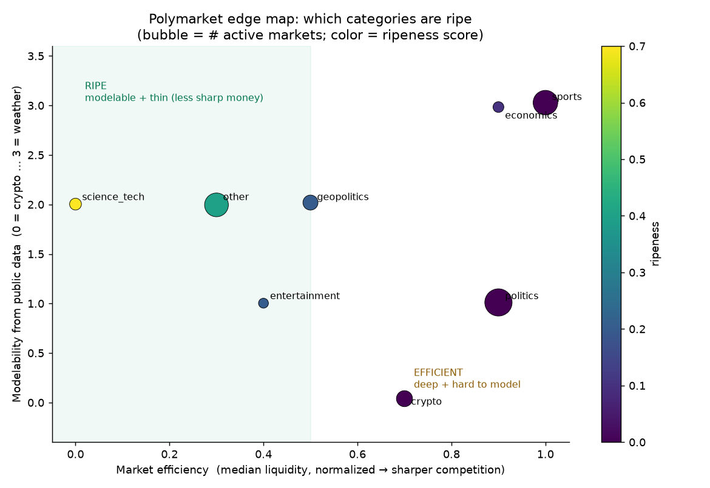

# Where is the edge on Polymarket? A category ripeness map

A pivot from the CFB work: instead of one sport, which *sectors* of Polymarket are most
mispriced — i.e., where can a smart model most plausibly beat the crowd?

> **Read this first — what the data can and cannot show.** True probabilistic calibration
> (does a category's 30¢ markets resolve YES ~30% of the time?) needs **(forecast price at a
> point in time, eventual outcome)** pairs. The only free, cloneable dataset
> ([manja316/polymarket-historical-data](https://github.com/manja316/polymarket-historical-data))
> is a **liquidity-head snapshot**: it gives outcomes (from `outcome_prices` settlement) but
> only *settled* prices for resolved markets, plus a single 10-hour price sample. Just **32
> markets** can be paired into a forecast→outcome test — enough for one aggregate sanity
> check, nowhere near enough to calibrate 8 categories. Polymarket's live API is blocked in
> this environment, and the full price history is paywalled. So the ranking below is built
> from the signals that *are* robust on all 9,550 markets — **liquidity depth, the live
> longshot surface, and the toss-up share** — combined with a **modelability** judgement and
> anchored by this repo's own hard-won finding that even sports is barely beatable where the
> market is liquid. It is a reasoned map, not a measured calibration table.

## The one calibration number we can compute
On the 32 poolable markets (live and uncertain on 2026-04-17, resolved later): **Brier 0.051**,
mean price **24.5%** vs realized **21.9%**. Directionally that is (a) **well-calibrated in
aggregate** — consistent with the academic literature that Polymarket is broadly efficient —
and (b) a **faint longshot-overpricing tilt** (priced a touch above what hit), the classic
favorite–longshot bias. n=32, so treat it as a smell test, not a result.

## What is measurable per category (all active markets)

| Category | Active mkts | Median liquidity | Longshot share (<10¢) | Toss-up share (35–65¢) | Modelable? |
|---|---:|---:|---:|---:|---|
| **science_tech** | 77 | **$16k** (thinnest) | 58% | **14%** | ✓✓ base rates, domain models |
| other (mixed) | 432 | $28k | 54% | 10% | ✓ mixed |
| entertainment | 42 | $32k | 55% | **14%** | ✗ soft |
| geopolitics | 149 | $40k | 59% | 5% | ~ noisy |
| crypto | 176 | $52k | 47% | 11% | ✗ ~random walk |
| economics | 58 | $72k | 72% | 3% | ✓✓ scheduled data |
| politics | 582 | $72k | 77% | 6% | ~ already priced |
| sports | 467 | **$88k** (deepest) | **86%** | 2% | ✓✓ but tracks Vegas |

Two coordinates decide ripeness: **modelability** (can public data beat the crowd?) on one
axis, **competition/efficiency** (how much sharp money is already here?) on the other. The
ripe corner is *modelable × thin*.

## Ranking — most to least ripe

1. **Science/tech & other underfollowed data-driven markets — ripest.** Thinnest liquidity
   (~$16k median → least sharp competition), genuinely modelable from public information
   (launch schedules, FDA/approval base rates, product-release history, benchmark trends), and
   the **largest toss-up surface (14%)** — the near-50¢ markets where a real information edge
   converts to the most expected profit. Few sharps bother; a diligent modeler can.
2. **Economics — high ceiling, watch the depth.** Extremely modelable around scheduled
   releases (CPI, rate decisions, jobs) where consensus models are strong, but liquidity is
   deeper and the surface is mostly longshots (72%) rather than toss-ups — the edge is in
   *fading overpriced tails*, not in coin-flips.
3. **Weather — modelable but tiny.** Professional forecasts (NWS/ECMWF) beat laypeople
   outright, the textbook edge; but the category is small and mostly short-dated/resolved, so
   opportunity is scarce.
4. **Sports — modelable, but efficient where it's liquid.** The deepest markets ($88k) with
   the biggest longshot surface (86%). This repo *proved* the catch: our best CFB model still
   couldn't beat the closing line (§5 of the main report) — the liquid US game markets track
   Vegas and are effectively efficient. The edge lives only in the **thin, niche, or
   international** sports markets the sharps ignore.
5. **Geopolitics / entertainment — situational.** Geopolitics is modelable only with
   disciplined base-rate forecasting and is noisy; entertainment has toss-ups but is soft and
   idiosyncratic (awards, box office).
6. **Politics — hard.** Very deep, the most sharp attention, and polls/fundamentals are
   already priced. Modelable in principle, but you are competing with everyone who read the
   same polls.
7. **Crypto — least ripe.** Deep and liquid, and the outcomes (price hitting a level) are
   ~random walks with no public-data edge. Efficient market, unmodelable target.

## The rule of thumb this produces
**Edge = modelability × obscurity.** Hunt the categories that are (a) predictable from public
data and (b) too thin or unglamorous for sharp money — science/tech, scheduled-data economics,
weather, and *niche* sports. Avoid the deep, glamorous, or unpredictable ones — politics,
crypto, and the marquee sports lines that already equal Vegas. And harvest the mild
favorite–longshot tilt (sell overpriced longshots) anywhere it appears.

## To turn this into a measured result
Give the harness real forecast→outcome pairs — the full Polymarket price history (Gumroad
export) or an allowlisted `gamma-api.polymarket.com` — and `scripts/polymarket_edge_map.py`
already computes per-category Brier/reliability the same way `src/cfbrank/metrics.py` does for
football; the 32-market aggregate would become a proper per-sector calibration table.

*Source: manja316/polymarket-historical-data (free tier), 9,550 markets. Reproduce:
`POLYMARKET_DIR=/path/to/clone python scripts/polymarket_edge_map.py`.*
